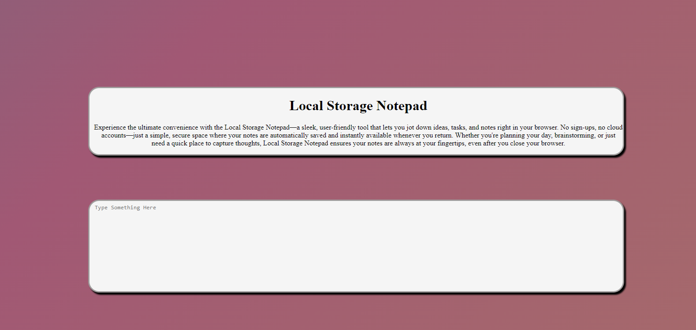

# Local Storage

This feature allows users to enter text into a textarea field within a web application. The entered text is automatically saved to the browser’s local storage.

> The demo can be viewed [here](https://bilal4821.github.io/Local-Storage-Notepad/)

## Technologies Used
- HTML
- CSS
- Javascript

## Features

- The text is automatically saved to local storage as the user types, without needing to click any buttons.
- The text remains in the textarea even after closing and reopening the browser, thanks to local storage.
- The saved text is automatically displayed in the textarea when the page is loaded, requiring no extra steps from the user.

## Preview 
